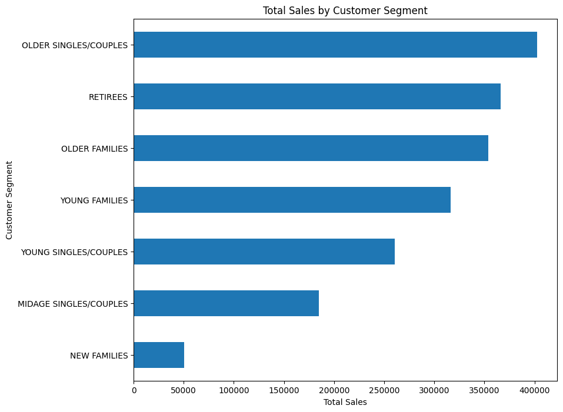
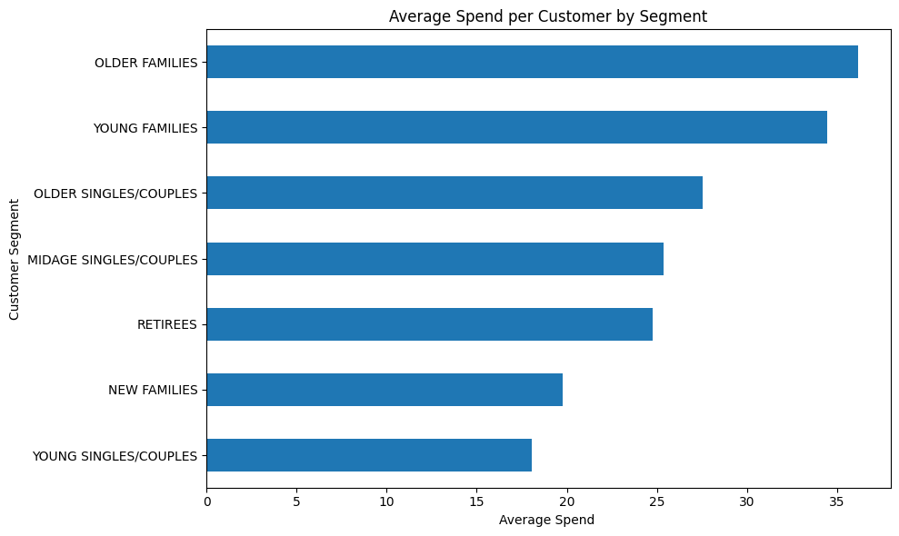
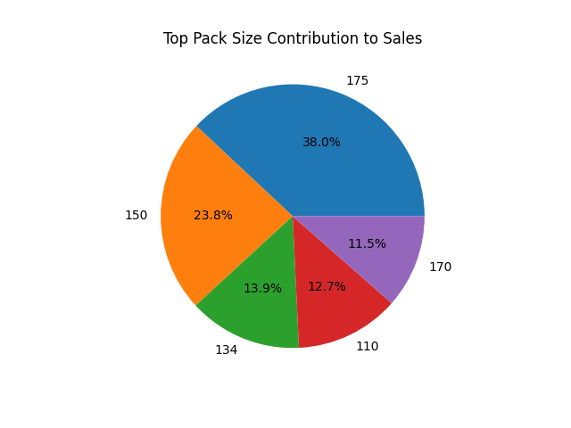
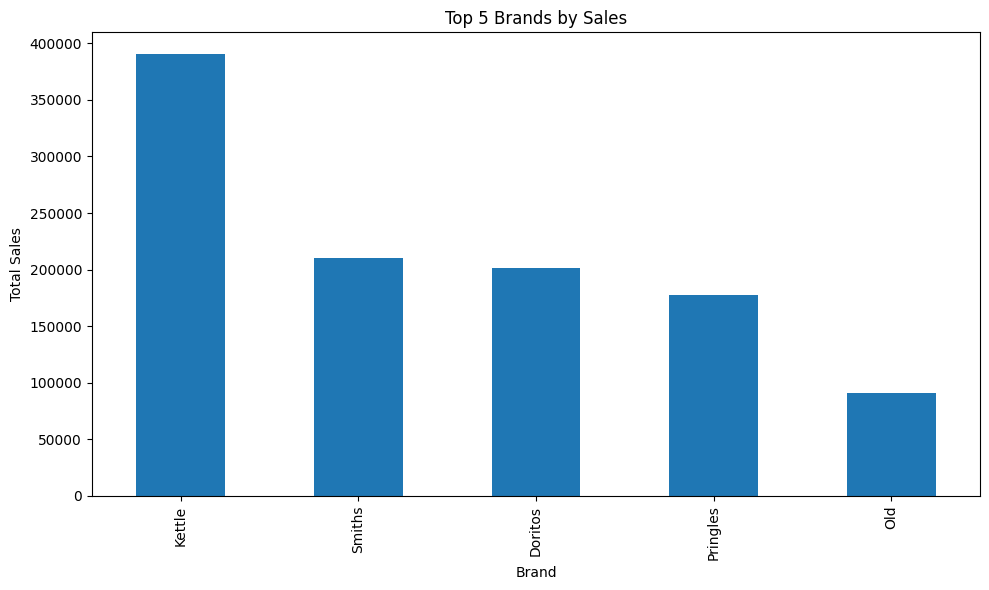

🛒 Customer Purchasing Behavior Analysis

 🎯 Objective

To analyze customer purchasing behavior in the chips category and identify key segments driving sales.

 📌 Project Overview

This project focuses on analyzing transaction and customer data to understand purchasing patterns and identify high-value customer segments. The goal is to derive insights to support business decisions.
The analysis focuses on identifying high-value customers and understanding what drives their purchasing behavior.

 📌 Project Context
This project is based on a retail analytics case study from the Quantium Virtual Internship. While the problem statement was provided, the entire analysis, data processing, and visualizations were implemented independently using Python.

 🧩 Problem Statement

* Identify key customer segments contributing to sales
* Understand purchasing behavior and trends
* Provide actionable recommendations to improve performance

 📂 Dataset Description

 🧾 Transaction Data

* Date
* Store number
* Customer ID
* Product details
* Quantity
* Total sales

👤 Customer Data

* Customer ID
* Lifestage
* Premium customer category

 ⚙️ Data Preprocessing

* Converted date column into datetime format
* Checked for missing values and duplicates
* Extracted **pack size** from product names
* Extracted **brand name** from product names
* Merged transaction and customer datasets

 🧠 Feature Engineering

* Created pack size column
* Created brand column
* Derived key metrics:

  * Total sales
  * Average spend per customer
  * Average quantity per customer

 📊 Analysis Performed

* Sales by customer segment
* Average spend per segment
* Quantity purchased per segment
* Pack size contribution
* Brand-level performance

 🔍 Key Insights

* Older Families and Young Families contribute the highest sales and spending.
* These segments spend more and purchase higher quantities
* Sales are driven by bulk purchasing behavior
* Larger pack sizes (175g, 150g) dominate sales
* Top brands: Kettle, Smiths, Doritos

---

 📈 Visualizations

**Sales by Customer Segment**

**Average Spend per Customer**

**Pack Size Contribution**

**Top Brands by Sales**

---

 💡 Business Recommendations

* Target family segments with promotions and offers
* Focus on larger pack sizes to increase revenue
* Strengthen partnerships with top-performing brands

 🗂️ Project Structure

quantium-customer-analysis/
│
├── data/
├── notebook/
├── images/
└── README.md

 📌 Conclusion

This project highlights how analyzing customer segments and purchasing patterns can help improve sales strategies and business decisions.
